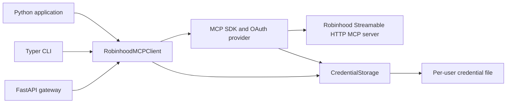

# Architecture

The wrapper has one reusable async MCP client. The CLI and REST gateway adapt that client to
their interfaces rather than implementing separate OAuth or tool execution paths.

## Module boundaries

| Module | Responsibility |
| --- | --- |
| `config.py` | Read and validate environment settings and gateway bind restrictions |
| `storage.py` | Credential storage protocol, configuration fingerprint, and atomic JSON persistence |
| `auth.py` | Callback parsing, flow handle, and one-shot loopback callback receiver |
| `client.py` | OAuth coordination, connection lifecycle, MCP discovery, schema validation, and execution |
| `serialization.py` | Preserve MCP field aliases and structured content in JSON output |
| `api.py` | REST request models, API-key checks, process lifecycle, and HTTP error mapping |
| `cli.py` | Command structure, inline/file JSON arguments, and formatted output |
| `errors.py` | Public wrapper exceptions with stable machine-readable codes |

The MCP SDK handles protocol negotiation, authorization-server discovery, dynamic registration,
PKCE, and token refresh. The wrapper supplies OAuth client metadata, storage, callbacks, and
transport configuration. Tool names and schemas are obtained at runtime.

## Authentication and connection lifecycle

`start_login()` creates one pending flow and returns its ID, authorization URL, redirect URI,
and expiry. The browser flow runs a temporary HTTP loopback receiver; the manual flow accepts
the full callback URL through `AuthorizationFlow.complete()`. Callback parsing checks the
registered redirect origin and path and requires a code and state. The wrapper checks the
active flow's state before passing the callback to the SDK, which validates OAuth state and
exchanges the authorization code.

Only one flow can be pending per client. Gateway flows are held in process memory, so a restart
loses the pending flow; start a new one after restart. Credential storage retains OAuth tokens
and client registration. `logout()` removes tokens, while `reset_credentials()` removes both.
Neither operation revokes upstream authorization.

Entering the client's async context connects and initializes an MCP session with stored
credentials. `connect()` never opens an interactive login. The SDK can refresh stored tokens,
and the caller receives `AuthenticationRequired` if reauthorization is needed. Exiting the
context closes local transports and tasks. Remote MCP session termination is disabled because
the configured Robinhood transport does not support the SDK's termination request.

The gateway holds a shared client for its lifespan. Its shutdown cancels pending login and
closes the connection. A dedicated connection task owns the SDK's transport and task groups,
so a later request or shutdown can signal cleanup without exiting another task's context.
The implementation is intended for one user and one worker; locks
coordinate operations inside that process, and credential files are not coordinated across
processes.

## Discovery, validation, and results

`list_tools()`, resource listing, and prompt listing return native paginated `mcp-types` models.
`refresh=True` bypasses the SDK cache. `list_all_tools()` follows every page and rejects repeated
cursors. The CLI and REST listing routes return a single page; callers follow `nextCursor`.

Before execution, `call_tool()` discovers the tool, refreshes discovery if the name is unknown,
and validates arguments using the advertised JSON Schema. A valid payload is submitted once.
The wrapper does not retry tool execution after transport failures. If the reply is lost after
an order is accepted, the caller must check the account before deciding what to do next.

Python callers receive native models, including content blocks, structured content, metadata,
and the `is_error` flag. JSON output uses MCP aliases such as `isError`, `inputSchema`, and
`structuredContent`. A tool-level error remains a successful protocol response and HTTP 200;
transport, authorization, and wrapper validation failures use exceptions and mapped HTTP errors.

## Extension points

Pass a `Settings` instance to `RobinhoodMCPClient` to set explicit configuration. Pass an
implementation of `CredentialStorage` as `storage=` to use a different credential backend.
Custom stores must support token and client-registration reads, writes, and independent clears.
`create_app(settings, client=...)` supports injecting a client, which is useful for tests.

Keep trade approval, strategy limits, audit policy, and account isolation in the calling
application if those features are required. Schema validation checks the payload's structure;
it does not determine whether a trade is suitable or intended.

See [CONTRIBUTING.md](../CONTRIBUTING.md) for verification and
[operations](operations.md) for deployment behavior.
